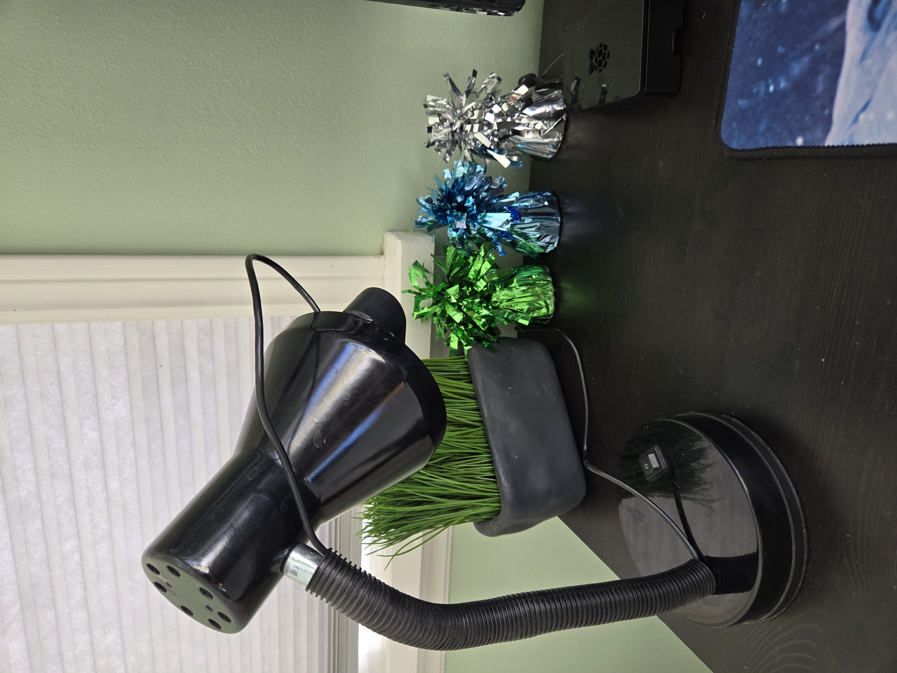

# Balloon Weight Random Number Generator

Dependencies: *libopenssl-dev, libopencv-dev, nodejs (optional)*

I have needed random numbers to produce various keys and seeds. It seemed more fun to use my own random numbers. It is simple to implement as the heavy lifting is done by openssl and opencv. Inspired by Cloudfare's lava lamp wall.

There are two things everyone wants to see on here: images and results. So as silly as it may seem, here are 32 random bytes!

`70389f46b4e90b26b7ed9b3baf84b179e9bd9bbd6ace29dbc3d0f4e91dde76be`





## Source of Entropy

First I need a source of random data. We had these balloon weights left over from a birthday party. There is a vent behind my desk which endlessly blows the frilly bits around. Since the weights are shiny and reflective, they are sensetive to any changes in lighting, and even to objects in the room. They are small and convenient on the desk. I superglued a webcam to a gutted desk lamp just as a stand. It's a compact setup that blends in not too bad lol.

## Capturing Image Data

OpenCV is used to capture an image and extract the raw byte data. With other programs, its harder to get the pure pixel data without metadata sneaking in. I want, when the camera is covered and the photo is completely black, for the number that is output to always be the same, because the entropy is zero. This way I know that my program is doing what I think it should be doing. It's hard to have confidence in your random numbers when your program is giving unexpected results. So anyways, OpenCV makes this easy.

My cheap webcam captures 640x480 pixels.

```python
photo_pixels = 640 * 480
rgb_channels_per_pixel = 3
bytes_per_channel = 1
bytes_per_pixel = 3
bytes_per_image = photo_pixels * bytes_per_pixel # 921,600
bits_per_image = 7,372,800
```

That's tons of entropy. The hash-based pseudo random bit generators approved by NIST require only 440 or 888 bits of seed entropy, depending on the hash algorithm, allowing them to produce $2^{67}$ bits before reseeding is required. Not all of our pixels change, but a lot of them change. As long as one bit is different, we will produce a different random number. It might be worth counting how many pixels change, but for now we are just testing our outputs against a FIPS standard, which is described later.

## Generating Random Numbers

To convert the image data to random numbers, we use SHAKE256. This is a hashing algorithm from the SHA-3 family. I chose it because, unlike the more common SHA-2 algorithms, SHAKE256 can output an arbitrary number of bits. We only need one input image to use SHAKE256, wheras by using the more common SHA-256, we might need to capture and hash multiple images if the user requested more data than 512 bits. This hashing algorithm is provided by openSSL. That's it, we just hash the pixel data, and as long as our inputs are random, we get random outputs.

## Run the Program

##### Build and Run in Docker

```bash
./start_docker.sh
```

This will download and install the dependencies, compile the generator, start the nodejs server, make an HTTPS key and cert, expose the desired port, start the container, etc.

If you want to use a different port for the nodejs server, you should change it in `start_docker.sh` and also in `video_rand_server.js`

##### Interfacing via the Node.js Server over HTTPS

If you are going to use the web server to get your random numbers, you should use HTTPS. I have multiple computers and I run this on my homelab. I doubt some Amazon camera or whatever on my network would hijack my random number transmission, but who knows, use HTTPS.  `make_cert.sh` will create a cert and key. You can pull the cert out of the Docker container like so:

```bash
docker cp video_rand_container:/app/server.crt video_rand_server.crt
```

Then you have to securely get the cert onto your client computers. I encrypted it, then sent it via magic-wormhole to my other computers. If you delete and remake the container, don't forget to pull the most recent cert in this fashion and send it to your client computers, or else your client will get an error. The corresponding key is in the Docker file beside the server.

This is going to protect you by encrypting the data and verifying that the server is in fact the one you think you're communicating with.

Don't forget to have the nodejs server running, which is done automatically by the Dockerfile if you use that.

```bash
curl --cacert video_rand_server.crt https://<ip_of_nodejs_server>:<your_port>/?count=<num_bytes_you_want>
```

You can interface with it using curl, the browser, directly with the binary, etc.

If you don't want to use Docker to contain the backend and would rather compile from source, read the implementation details below and follow the Dockerfile for guidance.

## Testing the Output

To ensure that our output is sufficiently random, we can test it against the FIPS 140-2 standard. On Arch Linux, I'm using xxd to convert hex to binary, and rngtest from the package rng-tools to test our binary data against the FIPS 140-2 standard.

```bash
sudo pacman -S xxd rng-tools
curl --cacert video_rand_server.crt https://<ip_of_nodejs_server>:<your_port>/?count=40000 | xxd -r -p | rngtest
```

Here is the output:

```bash
rngtest: bits received from input: 320000
rngtest: FIPS 140-2 successes: 15
rngtest: FIPS 140-2 failures: 0
```

Looks good!

## Implementation Details

A couple of nasty details to make this work. Most of this should already be configured in the Dockerfile. If you want to compile from source then you'll need to know some of the following:

##### Image Capture Backend

OpenCV offers compatibility with multiple image capture backends. **Use GStreamer**. GStreamer leads to the same hash when the image is all black, a different hash otherwise. Other backends I tried gave either the same hash regardless of the input as if the backend was broken, or a different hash even if the camera was blacked out as if noise was being introduced into the input.

```cpp
cv::VideoCapture cap(0, cv::CAP_GSTREAMER);
```

- **Check that your instance of OpenCV was built with GStreamer compatibility**.  You would have to write a small program to check. I think the ones from Arch and Debian have it. Otherwise you have to build OpenCV from source with GStreamer enabled (not good).  The Dockerfile pulls the one from Debian and it has GStreamer support.

  ```cpp
  #include <opencv2/core.hpp>
  #include <iostream>
  
  int main() {
      std::cout << cv::getBuildInformation() << std::endl;
      return 0;
  }
  ```

  ```bash
  g++ -o check_gst check_gst.cpp $(pkg-config --cflags --libs opencv4)
  ./check_gst
  ```

- Even if OpenCV is built with GStreamer support, **you still probably need a package called `gstreamer1.0-plugins-good`** and then it will start working. This package is not in the main Debian or Ubuntu repositories. On Debian you need to change your apt sources to include `components: contrib non-free non-free-firmware`.  On Ubuntu you can get it from the Universe repo I think. As before, the Dockerfile does this for you.

##### Camera Test

I'm doing this to test the usb webcam. You probably want to test your camera and make sure that your random numbers are based on images that are getting taken properly.

```bash
docker exec -it video_rand_container /bin/bash
apt-get update
apt-get install fswebcam
fswebcam -r 640x480 --jpeg 85 -D 1 entropy.jpg
```

Then I would `docker cp` it out to look at it, or maybe use `magic-wormhole`.


